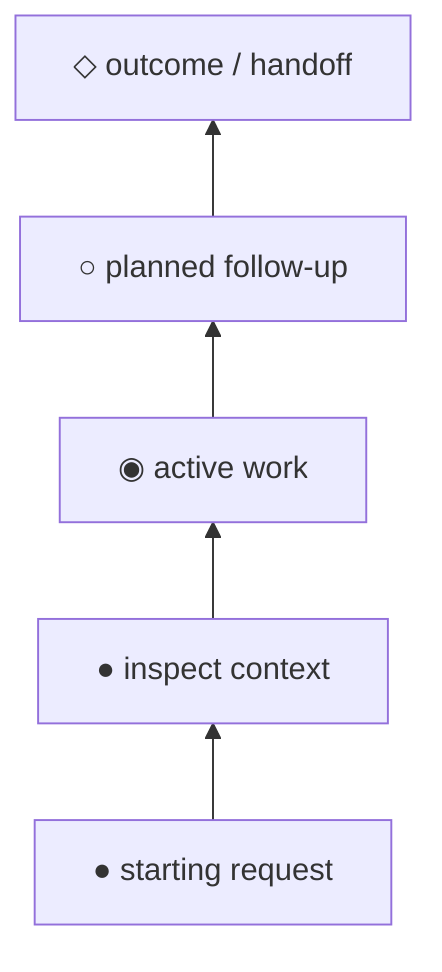

# Graph visualizer

Turn a process into a graph that reads clearly in a terminal and pastes cleanly
into rendered Markdown. The default local response is **ASCII in a fenced
`text` block**. Add Mermaid only when the target is a README, issue, PR body,
docs page, or the user asks for a rendered diagram.

Supporting docs, loaded only when needed:

- `references/ai-outfitter-persona-workflow.md` — canonical example graph for the ai-outfitter founder-operator persona workflow, in ASCII and Mermaid.

## Default decision

Default to ASCII. It is reviewable in chat, survives plain files, and follows the same newest-on-top/time-flows-up convention as `project-planning`. Mermaid is a secondary artifact, not the primary local planning surface.

## Design language

Use the `project-planning` graph dialect unless the user explicitly asks for a different diagram type:

- Time or sequence flows **up** when the graph is temporal: bottom = starting point or shipped history; top = future, final state, or handoff.
- Prefer the same state glyphs:
  - `●` done / durable / shipped
  - `◉` active / in-flight
  - `○` planned / optional / future
  - `◇` boundary / release / decision gate / terminal outcome
- Use box-drawing lanes for branches: `│ ├ ─ ╮ ╯`.
- Keep labels short and action-shaped. If the graph represents planned commits, labels MUST be real Conventional Commit subjects; otherwise use verb phrases.
- Put annotations two spaces after the graph label: owner, artifact path, status, risk, or validation evidence.

## Workflow

1. **Choose the graph kind.** Use a release-column style for ordered workflows; branch lanes for alternatives, stacked work, or dependency topology; Mermaid only when rendering matters.
2. **Identify nodes and boundaries.** Nodes are actions, states, artifacts, or decisions. Boundaries are releases, gates, handoffs, persona phases, or milestones.
3. **Draw the ASCII first.** Keep it compact enough for a terminal. Use blank `│` rows only to separate regions.
4. **Add Mermaid if useful.** For git-shaped plans, use `gitGraph BT:` and write the source oldest-first even though it renders newest-on-top. For general workflows, use `flowchart BT` so the visual orientation matches the ASCII graph.
5. **Validate against the story.** Read bottom-to-top: every edge SHOULD explain what makes the next node possible. Remove decorative nodes that do not change behavior or state.

## ASCII templates

Linear workflow:

```text
◇  outcome / handoff
│
○  planned future step
◉  current active step              owner/status
●  completed prerequisite           evidence/path
●  starting context
```

Branching workflow:

```text
◇  selected outcome
│
├─╮  ── decision: choose implementation path ──
│ ○  path B: deferred option          why deferred
├─╯
│ ◉  path A: active implementation    status
├─╯
●  shared discovery                   evidence/path
●  starting request
```

Project-planning-compatible release column:

```text
◇  vX.Y.Z (next)
│
○  feat(scope): planned commit
◉  fix(scope): in-flight commit       PR #n · status
●  feat(scope): landed commit         shortsha
◇  vX.Y.(Z-1) — YYYY-MM-DD
```

## Mermaid defaults

For general workflows:



For git-shaped plans, defer to the `project-planning` skill's `references/mermaid.md` conventions: use `gitGraph BT:`, preserve `● ◉ ○ ◇` in labels, mark planned commits with `type: HIGHLIGHT`, and write the Mermaid source oldest-first.

## Response policy

- Local/chat answer: SHOULD provide ASCII only unless Mermaid adds real value.
- README/issue/PR/docs artifact: SHOULD provide Mermaid plus an ASCII fallback when the graph encodes planning state.
- User asks for both: MUST keep the two renderings semantically identical.
- User asks for Mermaid only: MAY omit ASCII, but SHOULD still reason from an ASCII sketch before writing Mermaid.

## Validation checklist

- MUST make direction explicit when ambiguity matters (`time flows up`, `flowchart BT`, or `gitGraph BT`).
- MUST keep ASCII labels legible in a normal terminal.
- MUST not use color as the only carrier of state; glyphs and labels carry meaning.
- SHOULD use project-planning glyphs and lane mechanics for work plans.
- SHOULD default local responses to ASCII.
- SHOULD include the ai-outfitter persona workflow example when demonstrating the skill.
