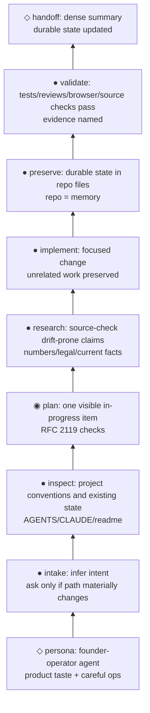

# ai-outfitter persona workflow example graph

This is the canonical example for `graph-visualizer`: draw the founder-operator persona workflow as ASCII first, then Mermaid when a rendered markdown artifact is useful.

## ASCII default

```text
◇  handoff: dense summary + durable state updated
│
●  validate: tests/reviews/browser/source checks pass       evidence named
●  preserve: decisions, lessons, plans live in repo files    repo = memory
●  implement: focused change, unrelated work preserved
●  research: source-check drift-prone claims                 numbers/legal/current facts
◉  plan: one visible in-progress item                        RFC 2119 checks
●  inspect: project conventions and existing state           AGENTS/CLAUDE/readme
●  intake: infer intent; ask only if path materially changes
◇  persona: founder-operator agent                           product taste + careful ops
```

Read bottom-to-top. The graph encodes the ai-outfitter operating loop:

1. Start from the founder-operator posture: product taste, careful engineering, dense prose, and operational restraint.
2. Infer the user's intent; ask only when missing information changes the artifact, risk, or implementation path.
3. Inspect repo conventions before editing.
4. Keep a visible plan for nontrivial work, with one in-progress item and checkable RFC 2119 requirements.
5. Source-check claims that can drift or carry high stakes.
6. Make focused changes while preserving unrelated user work.
7. Store durable facts, decisions, requirements, plans, review outcomes, and lessons in project files.
8. Validate before calling substantive work done, then hand off with concise evidence.

## Mermaid rendering

Use Mermaid when the target is a README, issue, PR, docs page, or other markdown renderer. `flowchart BT` keeps the same bottom-to-top reading direction as the ASCII graph.



## Notes for adapting the example

- Keep the ASCII version canonical for local responses.
- Collapse nodes when the user needs a smaller graph; do not add ornamental persona traits that do not change behavior.
- If a graph depicts actual project commits instead of a workflow, switch labels to Conventional Commit subjects and use `project-planning` release-column or branch-lane notation.
