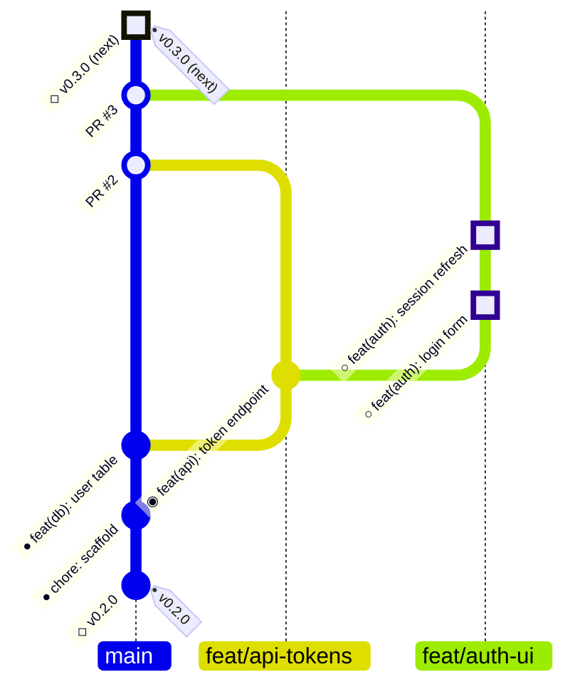

# Project planning

Agent-first planning: a plan is a future `git log`. Lay work out as the commits
that will land on main, grouped into PRs (stacked or parallel), with the next
release-please release at the top of the graph. One design language, two
renderings — an ASCII graph for terminals and plain files, a mermaid gitGraph
where markdown renders — and it lives anywhere text does: a plan file on disk,
a committed report, an issue body, notes, or just displayed in chat.

Supporting material, read on demand:

- `references/ascii.md` — ASCII templates: release column, stacked PRs,
  parallel lanes, milestones, multi-release roadmaps, drawing rules.
- `references/mermaid.md` — the same scenarios as mermaid gitGraph, plus
  renderer gotchas. Read before emitting any mermaid.
- `assets/PLAN.template.md` — copy as the starting point for an on-disk plan.
- `scripts/state.sh` — gather a repo's current state as graph-ready rows.
  Run from the repo root, or pass `owner/repo` / forge URLs (several at once
  for multi-repo projects); `--help` covers targets, the section → glyph
  mapping, and gh/tea forge support.

## The design language

Time flows **up**, exactly like `git log`: the bottom is shipped history, the
top is the future. The next release is always the top of the graph — stack
further releases above it only when road-mapping several milestones out. The
next unit of work is always the **lowest ○**, the one resting on shipped
history.

| glyph | state |
| --- | --- |
| `●` | shipped — on main; short sha recorded beside it |
| `◉` | in flight — commit exists on a branch / open PR |
| `○` | planned — not yet written |
| `◇` | release boundary — a release-please tag; predictions marked `(next)` |
| `── milestone: <name> ──` | milestone boundary — rides its branch's merge row `├─╮` in branch view; a bare separator in the flat release column |

Four rules:

1. **Every line is a real conventional commit message** (`feat(scope): …`,
   `fix: …`). When the work is done, the plan line is used verbatim as the
   commit message — the plan is executable, not a paraphrase of tasks.
2. **Versions above unshipped work are predictions.** Compute them the way
   release-please will (see below) and mark them `(next)` / `(later)`.
3. **Branches are parallel vertical lanes.** main is the leftmost column;
   each PR or milestone branch is its own lane to the right, and a stacked
   PR steps one lane further, forking from its parent PR's lane. Annotate a
   lane once, on its top commit: `PR #n  <head> → <base>`. Drawing mechanics
   (fork/merge rows, columns, alignment) live in `references/ascii.md`.
4. **Update by promotion, never rewrite.** `○ → ◉` when the PR opens,
   `◉ → ●` when it lands (record the sha), below a `◇` when released. `○`
   lines are free to reorder, split, or drop; they become immutable only as
   they become history. Shipped lines are never deleted — they are the
   "what's shipped" half of the story.

## The two renderings

Same scenario in both mediums (full templates in `references/`).

ASCII — terminals, chat, monospace notes:

```text
◇  v0.3.0 (next)
│
│ │ ○  feat(auth): session refresh  PR #3  feat/auth-ui → feat/api-tokens
│ │ ○  feat(auth): login form
│ ├─╯
│ ◉  feat(api): token endpoint      PR #2  feat/api-tokens → main · in review
├─╯
●  feat(db): user table             a1b2c3d
●  chore: scaffold                  9f8e7d6
◇  v0.2.0 — 2026-07-10
```

Mermaid — GitHub issues and PRs, READMEs, docs sites, artifacts:



The one mermaid trap: **source is written oldest-first even though `BT:`
renders newest-on-top** — write it as the ASCII graph read bottom-to-top. The
glyphs travel inside the commit labels so the legend survives both renderers.

## Release-please

- Predict the next version from the planned commit types: any `!` or
  `BREAKING CHANGE` → major; else any `feat` → minor; else → patch. In pre-1.0
  repos check the release-please config first (`bump-minor-pre-major`,
  `bump-patch-for-minor-pre-major` change these rules).
- A release lands as release-please's own `chore(main): release X.Y.Z` merge
  plus a tag. Don't list that chore commit in the graph — the `◇` line stands
  for it (in mermaid, a `◇ vX.Y.Z` anchor commit carries the `tag:`).
- A release may contain more than one milestone. Milestone boundaries divide
  the region under a `◇`; only reach for multiple stacked `◇ (next)` /
  `◇ (later)` sections when laying out a longer roadmap.

## Feature flags

Milestone work ships dark: it merges to main behind a feature flag that is
**off by default on main**, so code lands expeditiously instead of aging in a
long-lived branch, while the milestone branch's **preview environment runs
with the flag enabled**. Note the flag on the milestone boundary —
`── milestone: billing foundation · flag: billing_v2 ──` — and draw the
default-on flip as its own commit on main above the merge
(`feat(billing): enable billing_v2 flag`). This section is canonical; the
references carry only the notation.

## Where a plan lives

| home | rendering | lifecycle |
| --- | --- | --- |
| plan file on disk (`PLAN.md`, or where the project's AGENTS.md points) | either; ASCII default | living — promote glyphs in place |
| committed report (`docs/reports/2026-07-23-search.md`) | either | snapshot — dated, never edited after commit |
| issue / PR body | mermaid (GitHub renders it); ASCII fence as fallback | living while the issue is open |
| notes, wiki, chat display | ASCII | display |

If a plan has several homes, the on-disk plan file is canonical; reports and
issue bodies are snapshots of it.

## Projects that span repos

A project may span several repos in an org. Release lines are repo-scoped, so
**never merge repos into one graph** — instead:

- One graph per repo, stacked in the same report, each with its own `◇`
  lines and version prediction.
- Shared milestone names tie the graphs together: the same
  `── milestone: <name> ──` boundary appears in every repo the milestone
  touches (each with its own flag and preview environment).
- Gather state back to back with one call:
  `state.sh org/app org/api org/infra` prints one report per repo.
- The plan file is canonical in the project's lead repo; the other repos'
  plans (and the org report) point to it.

## Project Repos

```text
~/repos/<username/org>
- /<repo-name>/
- /<repo-name>.worktrees/<feat,fix,chore,milestone>/<branch-name>/
```

The worktree types are owned by the `subagent-delegation` skill — follow its
list. `scripts/state.sh` resolves `owner/repo` targets to the primary
checkout (`~/repos/<owner>/<repo>`). Milestone readmes live in the repo at
`docs/milestones/M<n>-<slug>/`, where `n` is `N` while the milestone is a
draft/RFC and a number once actively tracked (grouping issues on the forge).

## Working the plan (the agent loop)

1. **Plan** — run `scripts/state.sh` to gather what already exists: the
   bottom `◇`, the `●` rows, open `◉` lanes, and milestone/issue groupings
   (repo layout and milestone dirs: see Project Repos). Then enumerate the
   commits that will land on main, dependency order first (bottom of the
   graph upward), each as a real conventional commit message. Group into
   PRs: stack dependent spans, lane parallel ones. Predict the version, draw
   the `◇` on top.
2. **Execute** — take the lowest `○`, implement it, commit with the plan line
   verbatim.
3. **Promote** — `○ → ◉` when the PR opens; `◉ → ●` when it lands on main
   (record the short sha, drop the PR annotation).
4. **Cut** — when release-please merges the release PR, turn `vX.Y.Z (next)`
   into `vX.Y.Z — YYYY-MM-DD` and open a new `(next)` section above if more
   work is planned.
5. **Report** — asked "what's shipped / what's next", render the graph in the
   medium at hand instead of writing a prose status paragraph. The graph is
   the status; prose is commentary around it.

## User Personas

Having a specific persona in mind helps keep project development focused and
demonstrable.

## Demos

Projects SHOULD demo as early as possible with a well defined user persona in
mind. Demos MUST have one or more channels declared to disseminate to. That
is, before user features/milestones are implemented we should have a clear
persona and demo in place, allowing us to think critically about the work
being done, make informed adjustments, and present decisions around planning
and scope against reality.

## Platform Work

Platform work's persona is the internal team responsible for maintaining and
evolving the underlying infrastructure, tools, and shared services that
support the development and delivery of user-facing features. It should
always be committed separately from feature work and use `chore` type
commits. These should be cherry-picked or merged via a pull request to main
as soon as possible to improve velocity and developer experience.
