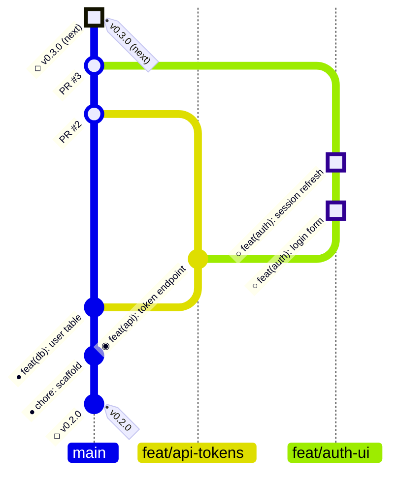

# Project planning

Agent-first planning: a plan is a **projected git graph** — the future `git log`,
written before the work exists. Lay work out as the commits that will land on
main, grouped into PRs (stacked or parallel), with the next release-please
release at the top of the graph.

The notation is deliberately not new — it borrows the model engineers already
have instead of teaching a board or an issue tracker's idea of an epic. The
graph is plain text, so it lives anywhere text does: a plan file on disk, a
committed report, an issue body, notes, or a chat message. One design language,
two renderings — an ASCII graph for terminals and plain files, a mermaid
gitGraph where markdown renders.

Supporting material, read on demand:

- `references/ascii.md` — ASCII templates: release column, stacked PRs,
  parallel lanes, milestones, multi-release roadmaps, drawing rules.
- `references/mermaid.md` — the same scenarios as mermaid gitGraph, plus
  renderer gotchas. Read before emitting any mermaid.
- `assets/PLAN.template.md` — copy as the starting point for an on-disk plan.
- `scripts/state.sh` — gather a repo's current state as graph-ready rows.
  Run from the repo root, or pass `owner/repo` / forge URLs (several at once
  for multi-repo projects); `--help` covers targets, the section → glyph
  mapping, and gh/tea forge support.

## The design language

Time flows **up**, exactly like `git log`: the bottom is shipped history, the
top is the future. The next release is always the top of the graph — stack
further releases above it only when road-mapping several milestones out. The
next unit of work is always the **lowest ○**, the one resting on shipped
history.

| glyph | state |
| --- | --- |
| `●` | shipped — on main; short sha recorded beside it |
| `◉` | in flight — commit exists on a branch / open PR |
| `○` | planned — not yet written |
| `◇` | release boundary — a release-please tag; predictions marked `(next)` |
| `── milestone: <name> ──` | milestone boundary — rides its branch's merge row `├─╮` in branch view; a bare separator in the flat release column |

Five rules:

1. **Every line is a real conventional commit message** (`feat(scope): …`,
   `fix: …`). When the work is done, the plan line is used verbatim as the
   commit message — the plan is executable, not a paraphrase of tasks.
2. **Versions above unshipped work are predictions.** Compute them the way
   release-please will (see below) and mark them `(next)` / `(later)`.
3. **Branches are parallel vertical lanes.** main is the leftmost column;
   each PR or milestone branch is its own lane to the right, and a stacked
   PR steps one lane further, forking from its parent PR's lane. Annotate a
   lane once, on its top commit: `PR #n  <head> → <base>`. Drawing mechanics
   (fork/merge rows, columns, alignment) live in `references/ascii.md`.
4. **Update by promotion, never rewrite.** `○ → ◉` when the PR opens,
   `◉ → ●` when it lands (record the sha), below a `◇` when released. `○`
   lines are free to reorder, split, or drop; they become immutable only as
   they become history. Shipped lines are never deleted — they are the
   "what's shipped" half of the story.
5. **The planned commits are the commits that land.** A plan is only
   executable if its lines land on main individually; squash-merging a planned
   span collapses them into one commit and loses the dependency order and the
   per-step reasoning. Decide the landing mode when you draw the graph and
   record it on the plan — see [Landing the plan](#landing-the-plan).

## The two renderings

Same scenario in both mediums (full templates in `references/`).

ASCII — terminals, chat, monospace notes:

```text
◇  v0.3.0 (next)
│
│ │ ○  feat(auth): session refresh  PR #3  feat/auth-ui → feat/api-tokens
│ │ ○  feat(auth): login form
│ ├─╯
│ ◉  feat(api): token endpoint      PR #2  feat/api-tokens → main · in review
├─╯
●  feat(db): user table             a1b2c3d
●  chore: scaffold                  9f8e7d6
◇  v0.2.0 — 2026-07-10
```

Mermaid — GitHub issues and PRs, READMEs, docs sites, artifacts:


```mermaid
gitGraph BT:
  commit id: "◇ v0.2.0" tag: "v0.2.0"
  commit id: "● chore: scaffold"
  commit id: "● feat(db): user table"
  branch feat/api-tokens
  commit id: "◉ feat(api): token endpoint"
  branch feat/auth-ui
  commit id: "○ feat(auth): login form" type: HIGHLIGHT
  commit id: "○ feat(auth): session refresh" type: HIGHLIGHT
  checkout main
  merge feat/api-tokens id: "PR #2"
  merge feat/auth-ui id: "PR #3"
  commit id: "◇ v0.3.0 (next)" type: HIGHLIGHT tag: "v0.3.0 (next)"
```

The one mermaid trap: **source is written oldest-first even though `BT:`
renders newest-on-top** — write it as the ASCII graph read bottom-to-top. The
glyphs travel inside the commit labels so the legend survives both renderers.

## Release-please

- Predict the next version from the planned commit types: any `!` or
  `BREAKING CHANGE` → major; else any `feat` → minor; else → patch. In pre-1.0
  repos check the release-please config first (`bump-minor-pre-major`,
  `bump-patch-for-minor-pre-major` change these rules).
- A release lands as release-please's own `chore(main): release X.Y.Z` merge
  plus a tag. Don't list that chore commit in the graph — the `◇` line stands
  for it (in mermaid, a `◇ vX.Y.Z` anchor commit carries the `tag:`).
- A release may contain more than one milestone. Milestone boundaries divide
  the region under a `◇`; only reach for multiple stacked `◇ (next)` /
  `◇ (later)` sections when laying out a longer roadmap.

## Feature flags

Milestone work ships dark: it merges to main behind a feature flag that is
**off by default on main**, so code lands expeditiously instead of aging in a
long-lived branch, while the milestone branch's **preview environment runs
with the flag enabled**. Note the flag on the milestone boundary —
`── milestone: billing foundation · flag: billing_v2 ──` — and draw the
default-on flip as its own commit on main above the merge
(`feat(billing): enable billing_v2 flag`). This section is canonical; the
references carry only the notation.

## Where a plan lives

| home | rendering | lifecycle |
| --- | --- | --- |
| plan file on disk (`PLAN.md`, or where the project's AGENTS.md points) | either; ASCII default | living — promote glyphs in place |
| committed report (`docs/reports/2026-07-23-search.md`) | either | snapshot — dated, never edited after commit |
| issue / PR body | mermaid (GitHub renders it); ASCII fence as fallback | living while the issue is open |
| notes, wiki, chat display | ASCII | display |

If a plan has several homes, the on-disk plan file is canonical; reports and
issue bodies are snapshots of it.

## Projects that span repos

A project may span several repos in an org. Release lines are repo-scoped, so
**never merge repos into one graph** — instead:

- One graph per repo, stacked in the same report, each with its own `◇`
  lines and version prediction.
- Shared milestone names tie the graphs together: the same
  `── milestone: <name> ──` boundary appears in every repo the milestone
  touches (each with its own flag and preview environment).
- Gather state back to back with one call:
  `state.sh org/app org/api org/infra` prints one report per repo.
- The plan file is canonical in the project's lead repo; the other repos'
  plans (and the org report) point to it.

## Project Repos

```text
~/repos/<username/org>
- /<repo-name>/
- /<repo-name>.worktrees/<feat,fix,chore,milestone>/<branch-name>/
```

The worktree types are owned by the `subagent-delegation` skill — follow its
list. `scripts/state.sh` resolves `owner/repo` targets to the primary
checkout (`~/repos/<owner>/<repo>`). Milestone readmes live in the repo at
`docs/milestones/M<n>-<slug>/`, where `n` is `N` while the milestone is a
draft/RFC and a number once actively tracked (grouping issues on the forge).

## Landing the plan

Git history is the project's memory, and it documents itself when its commits
are the units someone chose: `git log` answers what happened and in what order
without anyone maintaining a changelog. That only holds while the commits you
planned are the commits that land.

**Never squash-merge a planned span.** Squash collapses a stack of deliberate
commits into one line and discards the sequence the plan encoded — the
dependency order, the per-step reasoning, and the ability to bisect or review
one step at a time. Squash exists for branches of scratch commits (`wip`,
`fix typo`, `address review`) — the opposite of a plan. A large PR is not a
reason to squash; it is the reason not to.

Choose the mode when you draw the graph:

| mode | when | effect on main |
| --- | --- | --- |
| fast-forward | the branch is already the history you want | its commits *become* main, unchanged, no merge commit |
| merge commit (`--no-ff`) | a milestone branch whose grouping is worth keeping | every commit lands, plus one merge commit naming the milestone |
| squash | scratch branches only — never a planned span | one commit; the plan's granularity is gone |

### Fast-forwarding main to a working branch

The cleanest landing, and the normal end state of working the loop: the branch
already holds exactly the commits the graph drew, so main moves to it.

```bash
git fetch origin
git rebase origin/main        # make the branch a linear descendant
git push origin HEAD:main     # fast-forward — the pushed commits are the commits on main
```

The rebase rewrites shas; the push does not. What a fast-forward preserves is
the commits themselves — no merge commit, nothing collapsed, nothing minted on
the way in.

**Stacked PRs are the motivating case.** Each PR in the stack is one clean
span; squash-merging them one at a time yields one commit per PR and loses the
inner detail. Instead let the stack accumulate on a single branch and
fast-forward main to its tip once the whole stack is approved — or land
bottom-up, fast-forwarding at each step. Same for a milestone branch behind a
flag: fast-forward, or `--no-ff` when the milestone boundary is worth a marker
in the log.

On a forge, `Create a merge commit` gives the `--no-ff` shape. `Rebase and
merge` keeps one commit per `○` but mints new shas, so any sha recorded beside
a `●` will not survive it; a true fast-forward means pushing the branch to main
directly. If the repo is squash-only, say so *before* planning a stack.

### Recovering from an accidental squash

The planned commits still exist on the original branch. Unpack them onto the
squash's parent, replay anything that landed after, and replace the squash:

```bash
git checkout <branch>
git rebase <squash-sha>^                  # real commits onto the squash's parent
git cherry-pick <shas landed after the squash>
git rev-parse HEAD^{tree}                 # MUST equal <squash-sha>^{tree}
git push --force-with-lease=main:<current-main-sha> origin HEAD:main
```

Four steps, none optional:

1. Verify the resulting tree is identical to what main already has — that proves
   the rewrite changed the shape of history, not the content.
2. Use `--force-with-lease`, so the push refuses if someone moved main while you
   worked.
3. Tell whoever authored commits that landed on top of the squash: their shas
   change.
4. Check for dirty worktrees on main before resetting them.

## Working the plan (the agent loop)

1. **Plan** — run `scripts/state.sh` to gather what already exists: the
   bottom `◇`, the `●` rows, open `◉` lanes, and milestone/issue groupings
   (repo layout and milestone dirs: see Project Repos). Then enumerate the
   commits that will land on main, dependency order first (bottom of the
   graph upward), each as a real conventional commit message. Group into
   PRs: stack dependent spans, lane parallel ones. Predict the version, draw
   the `◇` on top. **Record the landing mode** and confirm the forge allows it
   (see Landing the plan).
2. **Execute** — take the lowest `○`, implement it, commit with the plan line
   verbatim.
3. **Promote** — `○ → ◉` when the PR opens; `◉ → ●` when it lands on main
   (record the short sha, drop the PR annotation). Land by fast-forward or
   merge commit so each `○` becomes its own `●`; if one `●` appears where the
   plan drew several, the span was squashed — unpack it (see Landing the plan)
   rather than editing the graph to match.
4. **Cut** — when release-please merges the release PR, turn `vX.Y.Z (next)`
   into `vX.Y.Z — YYYY-MM-DD` and open a new `(next)` section above if more
   work is planned.
5. **Report** — asked "what's shipped / what's next", render the graph in the
   medium at hand instead of writing a prose status paragraph. The graph is
   the status; prose is commentary around it.

## Project steering documents

The graph says what will land and in what order. It does not say who the work
is for, what the project is obliged to do, what a shippable slice looks like,
or what this quarter is meant to achieve. Four document families under `docs/`
answer those, and they nest — a report scopes milestones, a milestone scopes
requirements, requirements are written for a persona:

```text
docs/
├── personas/                 who the work is for
├── requirements/             what the project is obliged to do (RFC 2119)
├── milestones/M<n>-<slug>/   a demoable slice, written as its announcement
└── reports/YYYY-MM-QN-*.md   what a period is meant to achieve; dated snapshots
```

A plan line that cannot be traced up this stack — no persona, no requirement,
no milestone — is a plan line worth questioning before it is worth writing.

### `docs/personas/`

One file per persona, from [`assets/PERSONA.template.md`](assets/PERSONA.template.md):
a **role**, an **optional org**, and a **bio**. That is the whole schema; the
bio carries everything that makes the persona behave like a person rather than
a label — what they already believe, what they will not tolerate, what they
compare you against.

Personas are cheap and worth having in quantity, because the interesting
feedback comes from the *matrix*: the same role at a different org, or the same
org with a different level of experience, reacts differently to the same page.
[`scripts/personas.sh`](scripts/personas.sh) composes atomic `--role`, `--org`,
and `--bio` fragments into every variant so a deep matrix costs one command:

```sh
scripts/personas.sh \
  --role "flight director" --role "procurement lead" \
  --org "national space agency" --org "commercial operator" --org "" \
  --bio "twenty years of crewed ops; distrusts anything without a margin" \
  --bio "first program; optimises for defensible paperwork" \
  --out docs/personas            # 2 × 3 × 2 = 12 personas; --dry-run to preview
```

Keep the fragments themselves as **building blocks** rather than in shell
history — [`assets/PERSONA.role.md`](assets/PERSONA.role.md),
[`assets/PERSONA.org.md`](assets/PERSONA.org.md), and
[`assets/PERSONA.bio.md`](assets/PERSONA.bio.md), copied into `docs/personas/`
and edited in place. Each `## ` heading is one fragment: the body beneath it,
or the heading itself when there is no body, so a one-word role and a
five-sentence bio share one file format. Preamble prose and HTML comments are
ignored, which lets the library explain itself and park a fragment without
deleting it.

```sh
scripts/personas.sh \
  --roles-from docs/personas/PERSONA.role.md \
  --orgs-from  docs/personas/PERSONA.org.md --org "" \
  --bios-from  docs/personas/PERSONA.bio.md \
  --out docs/personas
```

File and inline fragments combine, so the `--org ""` above adds the
unaffiliated variant alongside the library's orgs. Vary **bios** when you want
to know whether a page survives scepticism rather than ignorance: the same role
and org with a burned bio and a green bio will disagree, and that disagreement
is the signal.

### `docs/requirements/`

Formal, numbered obligations as `<PREFIX>-NNN-<topic>.md`, RFC 2119 throughout
— see [`assets/REQUIREMENT.template.md`](assets/REQUIREMENT.template.md) and the
governing [`assets/REQUIREMENTS-README.template.md`](assets/REQUIREMENTS-README.template.md)
(structure follows `ai-outfitter/outfitter`'s `docs/requirements/`). The parts
that matter:

- **Stable identity.** `<PREFIX>-NNN.M` numbers are permanent. Never renumber,
  never reassign. A withdrawn statement is replaced in place with
  `REQUIREMENT REMOVED (YYYY-MM-DD): <rationale>`; new statements append.
- **Traceability to tests.** A machine-verifiable requirement is pinned by a
  test carrying `THIS TEST VALIDATES A HARD REQUIREMENT (<PREFIX>-NNN.M)`, and
  those tests say they must not be modified unless the requirement changes.
- **Amend the requirement first.** When reality and a requirement disagree,
  edit the requirement with an `Amendment (YYYY-MM-DD): ...` note, *then* the
  pinned tests, *then* the implementation — landing together, so the diff
  carries the whole trace. The amendment note is what authorises touching a
  "must not modify" test.
- **One scope per file.** If a document needs "and" in its title, it is two.

Prefixes are per-subject, not per-repo: a repo may hold `OFTR-*` alongside
`CNTP-*` and `ORDR-*`. Requirements for a reusable package live with that
package (`code/<pkg>/docs/requirements/`), so the package can be extracted
without orphaning its contract.

### `docs/milestones/M<n>-<slug>/`

A milestone is a **demoable slice of user or business value, written as its own
announcement** — see [`assets/MILESTONE.template.md`](assets/MILESTONE.template.md).
Lead with the press release: the headline, the paragraph a customer would read,
the quote you could honestly give. If that paragraph cannot be written without
lying, the milestone is not scoped yet.

`n` is `N` while the milestone is a draft/RFC and a number once actively
tracked (grouping issues on the forge). A milestone **scopes requirements** —
it names which `<PREFIX>-NNN.M` statements it satisfies — and it **declares its
demo**: the persona who watches, the channel it goes out on, and the script.
Demo before implementation, so scope meets reality early; a milestone with no
declared channel is a milestone nobody will see.

Milestone work ships dark behind a flag (see [Feature flags](#feature-flags)),
which is what lets the demo exist before the feature is on for everyone.

### `docs/reports/`

Dated snapshots: `YYYY-MM-QN-<topic>.md`, with the quarter prefix preferred for
the planning bundle — `2026-07-Q3-plan.md`, `2026-07-Q3-financials.md`,
`2026-07-Q3-research.md`. The Q-plan states **what this quarter is meant to
accomplish**, which milestones serve it, and what is explicitly out.

Reports are **frozen when committed**. Later evidence does not rewrite a
report; it earns a dated addendum or a new report. Read the newest bundle
before planning substantial work — the graph you draw should serve the quarter
someone already committed to, or say plainly that it does not.

### Trying the product as a persona

Steering documents go stale unless someone uses the thing. Two scripts close
that loop by putting a persona in front of the running product:

- [`scripts/try-product.sh`](scripts/try-product.sh) launches headless Chrome
  with remote debugging on a page and prints the instruction block for the
  agent to *use* the product in character — then report first impression,
  what it tried, where it got stuck, and what it would tell the team.
- [`scripts/page-feedback.sh`](scripts/page-feedback.sh) captures a page
  screenshot and prints the instruction block for the agent to read the image
  and critique it as the persona.

```sh
scripts/try-product.sh http://localhost:4321/missions \
  --persona docs/personas/flight-director-national-space-agency.md \
  --task "decide whether you would approve this burn"

scripts/page-feedback.sh http://localhost:4321/investors \
  --persona docs/personas/procurement-lead.md --out /tmp/investors.png
```

Feedback from these runs is commentary until it changes a document: it belongs
in a persona's bio, a requirement, a milestone's demo script, or a report
addendum. Otherwise it evaporates.

## Platform Work

Platform work's persona is the internal team responsible for maintaining and
evolving the underlying infrastructure, tools, and shared services that
support the development and delivery of user-facing features. It should
always be committed separately from feature work and use `chore` type
commits. These should be cherry-picked or merged via a pull request to main
as soon as possible to improve velocity and developer experience.
