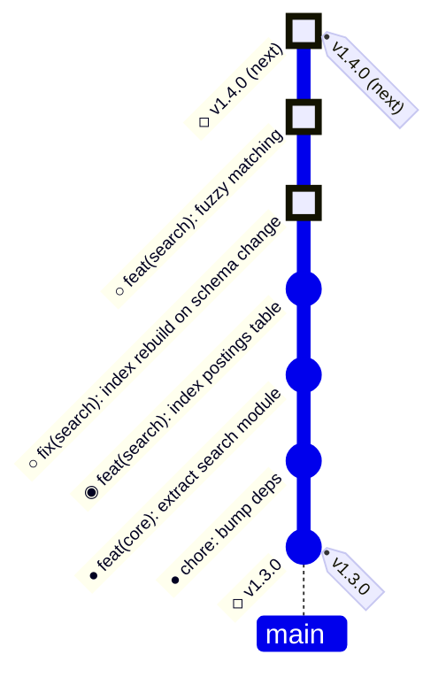
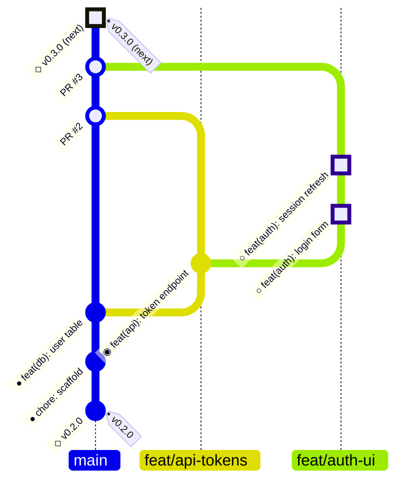
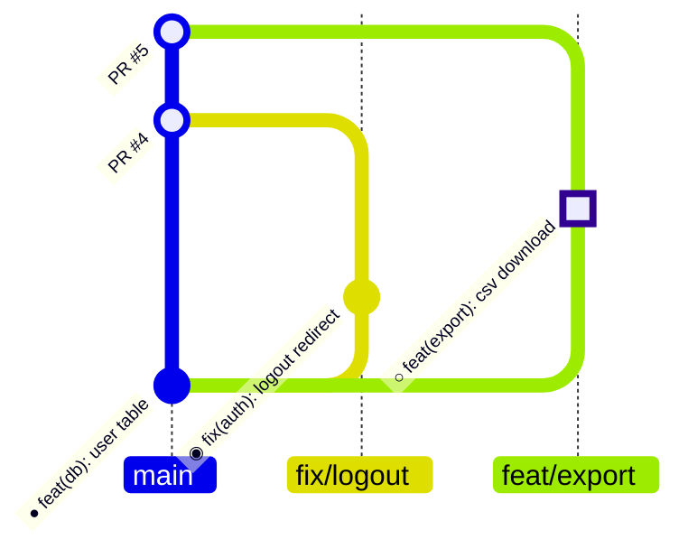
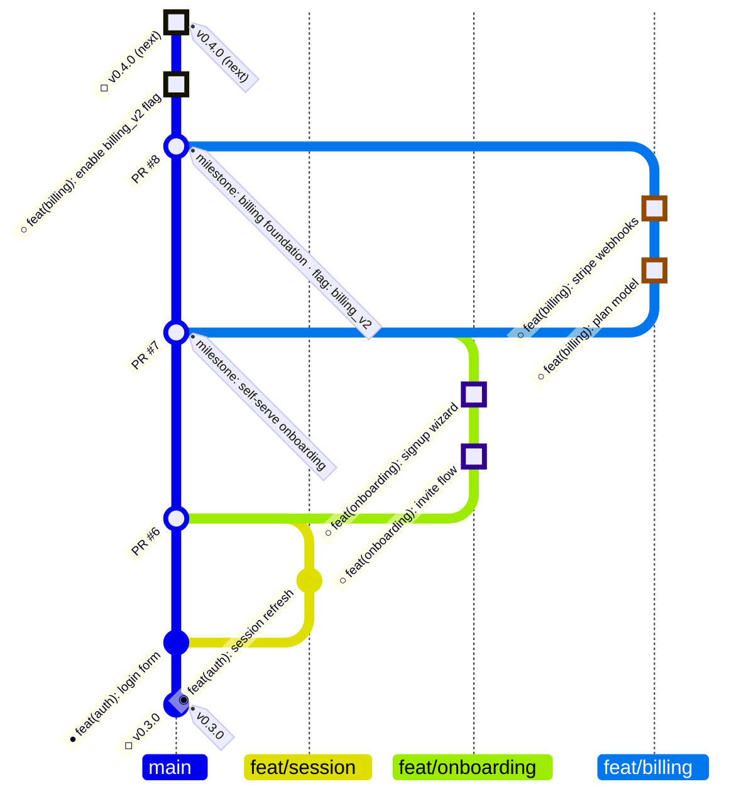
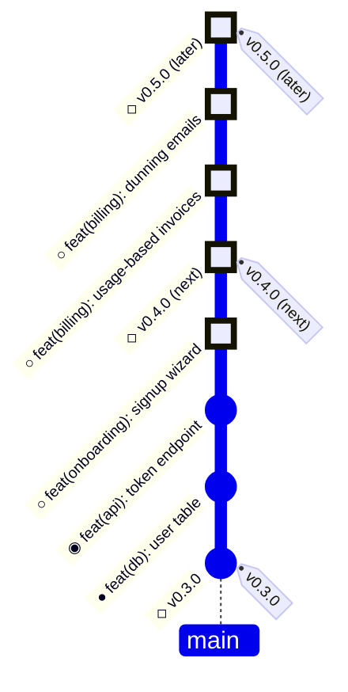
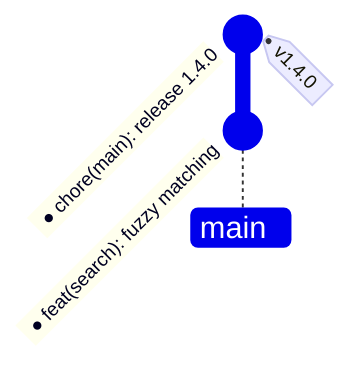

# Mermaid gitGraph templates

Scenarios A–E mirror `ascii.md` one-to-one (same commits, same release
membership); F shows how an actual cut renders. For GitHub issue/PR bodies,
READMEs, docs sites, and artifacts, where markdown renders diagrams.

## The one trap

**Source order is oldest-first, even with `BT:`.** Orientation flags only flip
the rendering; the first `commit` line in the source is always the oldest.
Write the source as the ASCII graph read bottom-to-top. `BT:` then renders it
newest-on-top, matching the design language.

## Conventions

- `gitGraph BT:` so the future is at the top. (`BT:` needs mermaid ≥ 11 —
  GitHub and GitLab are fine. If a renderer rejects it, drop to the default
  left-to-right, where the future is at the right.)
- The `● ◉ ○ ◇` glyphs travel inside the commit `id:` labels, so state
  survives renderers and colors. Additionally mark planned commits
  `type: HIGHLIGHT` so they're visually distinct.
- A release boundary is its own **anchor commit** carrying the `tag:` — it
  stands for the release-please chore commit, exactly like the ASCII `◇` row.
  Shipped: `commit id: "◇ v1.3.0" tag: "v1.3.0"`. Predicted:
  `commit id: "◇ v1.4.0 (next)" type: HIGHLIGHT tag: "v1.4.0 (next)"`.
  Never put a release tag on a feature commit — commits drawn above a `◇` in
  ASCII belong to the *next* release, and a commit only holds one `tag:`.
- A milestone is a branch lane beside main, and it completes at its merge:
  tag the merge — `merge feat/onboarding id: "PR #7" tag: "milestone:
  self-serve onboarding"` — the same merge-row boundary as the ASCII branch
  view. In a flat release-column graph, tag the milestone's last commit
  instead. Release anchors keep release tags off milestone merges, so several
  milestones fit inside one release.
- Flagged milestones carry the flag in the merge tag
  (`tag: "milestone: billing foundation · flag: billing_v2"`): the branch's
  preview environment runs with the flag on, main keeps it off by default so
  the merge lands expeditiously, and the default-on flip is its own commit on
  main above the merge.
- Label merges with the PR: `merge feat/auth-ui id: "PR #3"`.

## A. Release column (all on main)

## B. Stacked PRs

Branch from the branch below; merge into main bottom-up. The predicted
release's `◇` anchor follows the final merge.

## C. Parallel PRs

Independent branches both cut from main.

## D. Milestones within a release

Two milestone branches inside one release span — a release may contain more
than one milestone. Each milestone is a lane beside main; its merge carries
the milestone tag.

## E. Multi-release roadmap

## F. How a cut renders

When release-please merges its release PR, the tag lands on that chore commit.
Only in this "as it actually happened" view does the chore commit appear under
its real name:

In planning views, the `◇ vX.Y.Z` anchor stands for it.

## Gotchas

| gotcha | detail |
| --- | --- |
| source order | oldest-first, always — `BT:`/`TB:` only change rendering |
| `BT:` support | mermaid ≥ 11 (`TB:` ≥ 10.3); fall back to default LR if rejected |
| unique `id:`s | duplicate id strings collide (ids also drive `cherry-pick`); real commit messages are naturally unique |
| one `tag:` per commit | why releases get anchor commits — a milestone tag and a release tag can't share a commit |
| no ghost commits | gitGraph can't draw dashed/"future" commits — planned-ness is the `○` glyph plus `type: HIGHLIGHT`, never color alone |
| branch names | slashes are fine; quote a name that collides with a keyword (`branch "cherry-pick"`) |
| merges | the merged branch must exist and have ≥ 1 commit; `merge <branch> id: "…" tag: "…" type: …` are all valid |
| keep templates theme-free | omit `config:`/theme frontmatter for portability across renderers |
