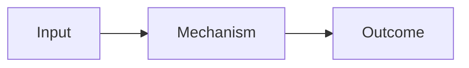

# Deck template

Use this template as a starting point. Adapt it to the repository theme and the presentation goal.

```md
---
theme: default
title: Presentation title
info: |
  One sentence that describes the talk.
author: Author name
transition: fade
mdc: true
---

---
layout: cover
---

# Presentation title

One clear thesis

<div class="mt-8 text-sm opacity-70">
Author · Event · Date
</div>

<!--
Open with the consequence for this audience.
-->

---
layout: statement
---

# The current model creates a specific cost

<!--
State the problem. Give the evidence aloud.
-->

---
layout: two-cols
---

# The old model and the new model differ at one boundary

::left::

## Before

- Short point
- Short point

::right::

## After

- Short point
- Short point

<!--
Explain the contrast from left to right.
-->

---
layout: default
---

# The mechanism has three parts



<!--
Explain the mechanism. Do not read the labels.
-->

---
layout: statement
---

# The evidence changes the decision

<div class="text-5xl font-semibold">
One memorable result
</div>

<div class="mt-6 opacity-70">
Source or qualification
</div>

<!--
State the result, method, and limit.
-->

---
layout: end
---

# Take the next action

One specific implication

<!--
End on the consequence. Do not summarize the whole deck.
-->
```

## Adaptation rules

- Replace every placeholder.
- Remove every slide that does not advance the thesis.
- Add evidence slides before you add explanation slides.
- Use the repository theme layouts when their names differ.
- Confirm that `mdc: true` is compatible with the existing deck before you keep it.

